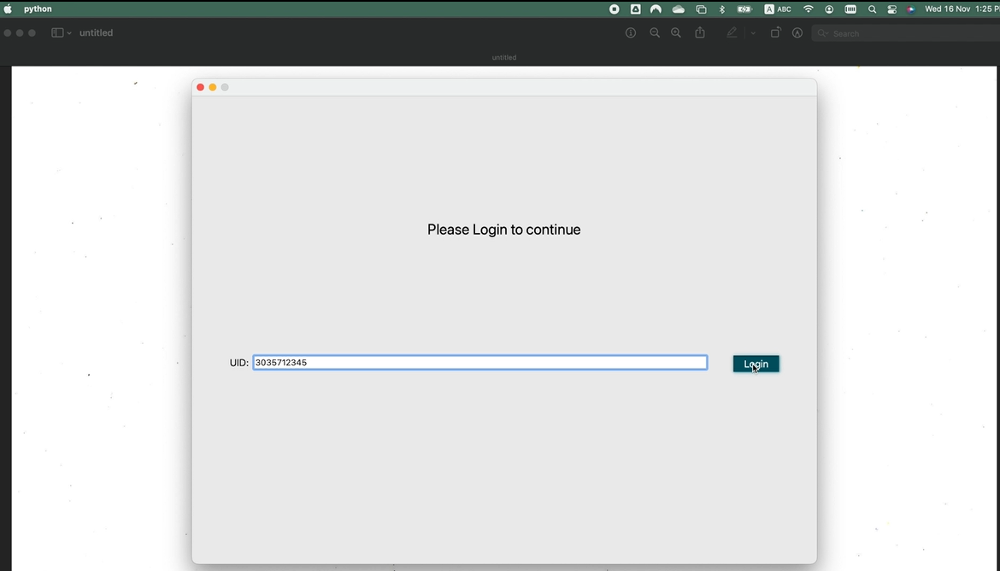
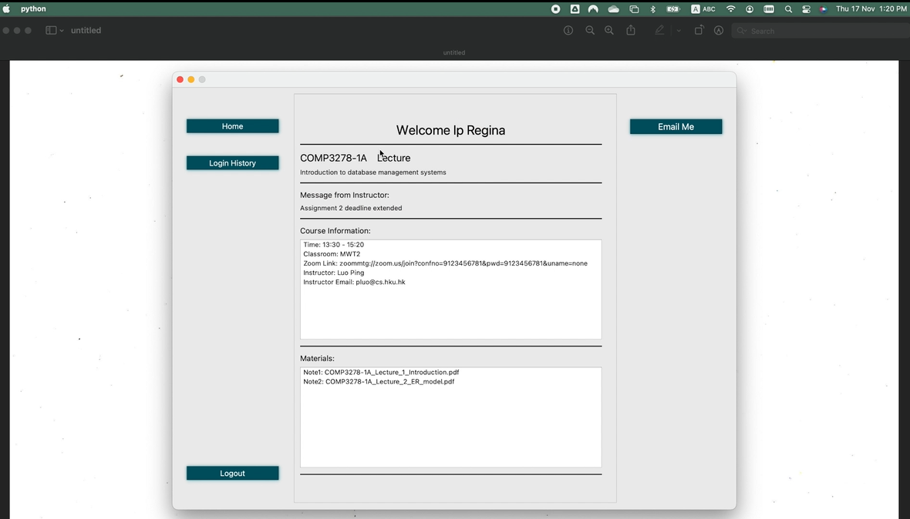
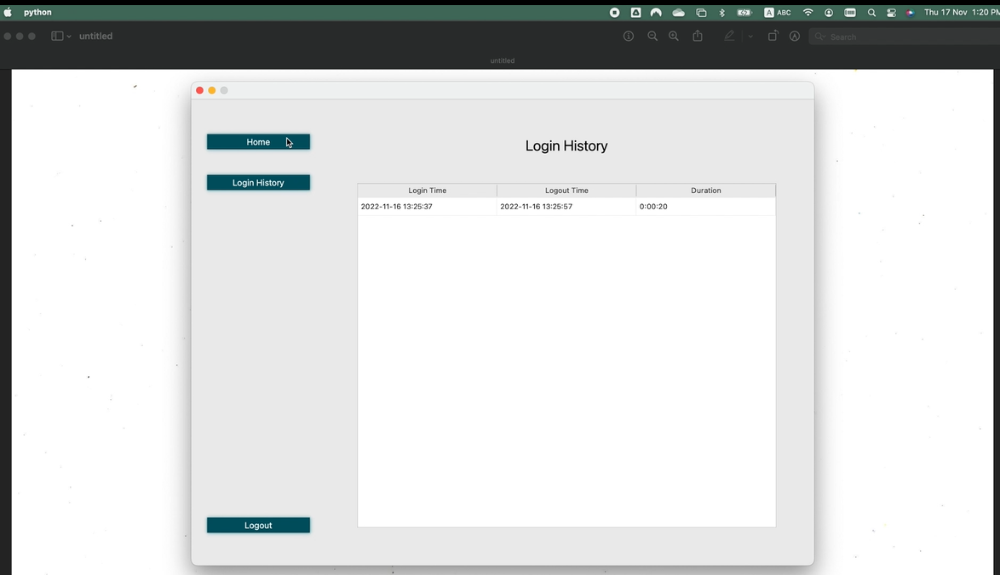
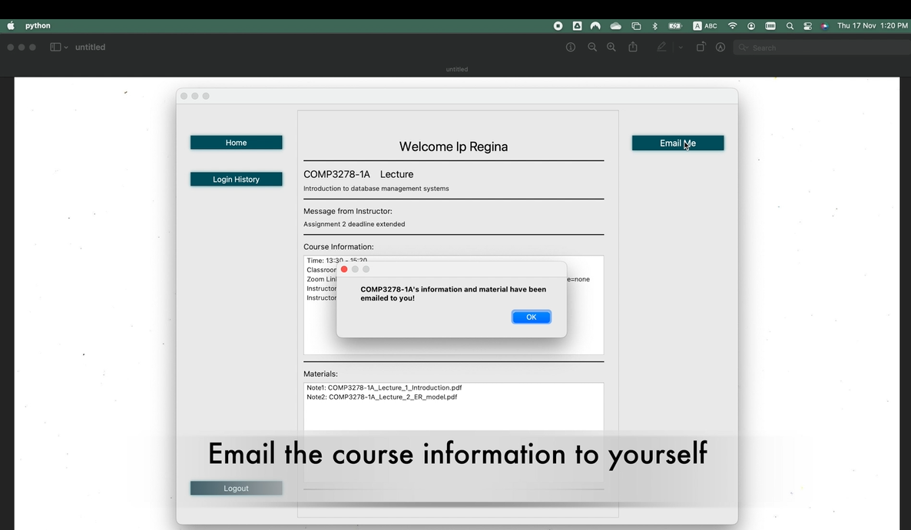
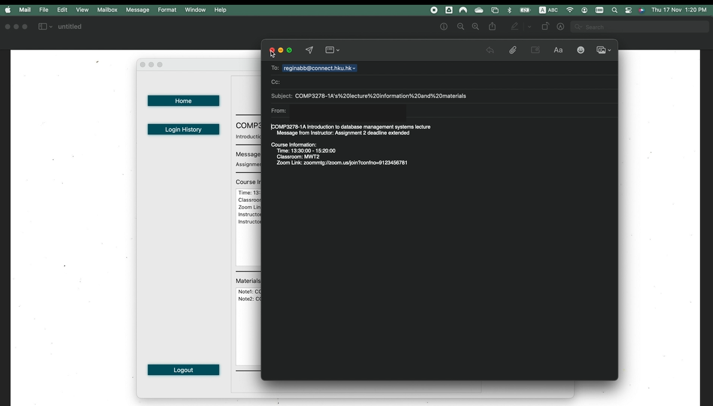

# COMP3278_G12


# Intelligent Course Management System (ICMS)

COMP3278 Introduction to database management systems – Group 12

## Screenshots












## Project Structure

    .
    ├── data_files                      # Database tables data
    │   └── ...
    ├── ui_files
    │   ├── FaceRecognition             # Face recognition
    │   │   ├── data                    # Raw photos for face recognition training
    │   │   ├── face_capture.py         # Collect face data
    │   │   └── train.py                # Train face recognition models
    │   ├── ...
    │   └── main.py                     # Application entry point
    ├── COMP3278-1A_Lecture_1...
    ├── COMP3278-1A_Lecture_2...
    ├── GroupDB.sql                     # SQL for Database tables creation
    ├── README.md
    ├── data.sql                        # SQL for database tables data insertion
    └── temp.pdf

## Database Setup

You need to create a mysql database manually first before starting the app.

First, create database by running GroupDB.sql.

Second, insert data for tables in database by running data.sql. The data files mentioned in data.sql are stored in the folder "data_files". See the below link for enable loading local data.  
https://stackoverflow.com/questions/59993844/error-loading-local-data-is-disabled-this-must-be-enabled-on-both-the-client

## Setting Up Development Environment

### Python 3.7/3.8
Conda environments can be used in by creating and activating a new conda environment  
1. Install python dependencies, the requirements.txt is in ui_files\FaceRecognition directory

```bash
pip install -r requirements.txt
```

2. Install PyQt5 package

```bash
pip install PyQt5
```

### Environment variables

All environment variables are stored directly in `main.py`.
This is where we store sensitive information, such as database login information.

1. Change / fill in the missing information, such as database login username and password.
```py
conn = mysql.connector.connect(
    host="localhost", user="root", passwd="", database="3278_GroupProject"
)


self.myconn = mysql.connector.connect(
            host="localhost",
            user="root",
            passwd="",
            database="3278_GroupProject",
        )
```

## Run Application
```bash
python main.py
```

